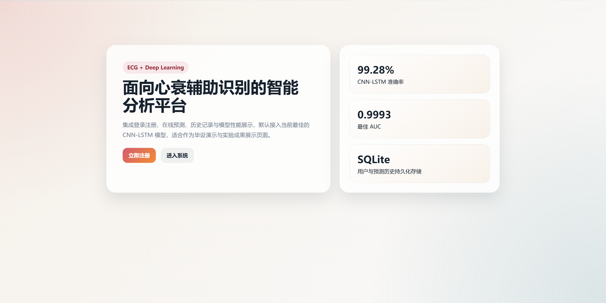
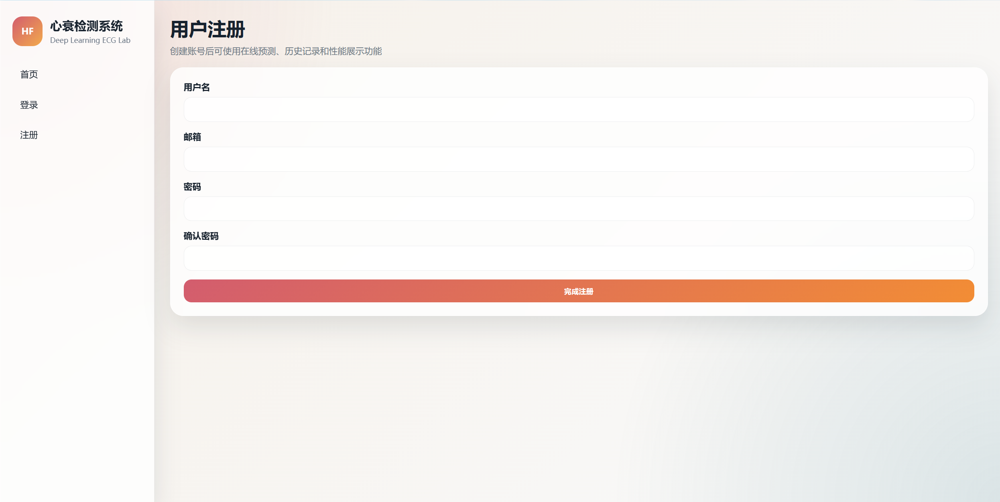
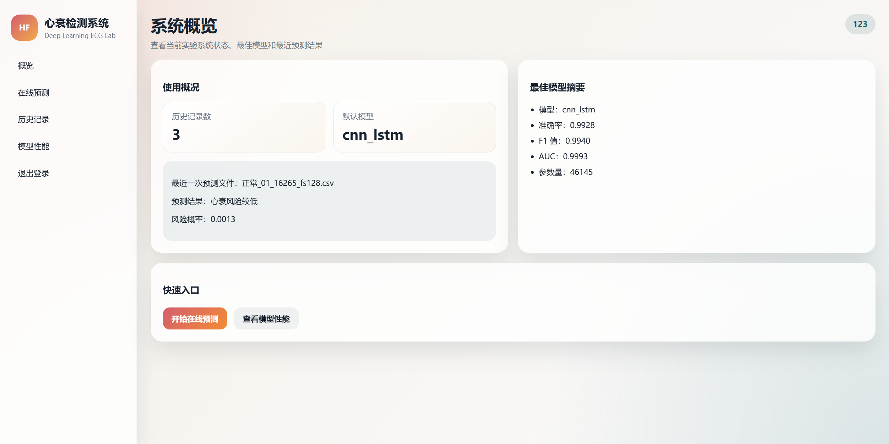
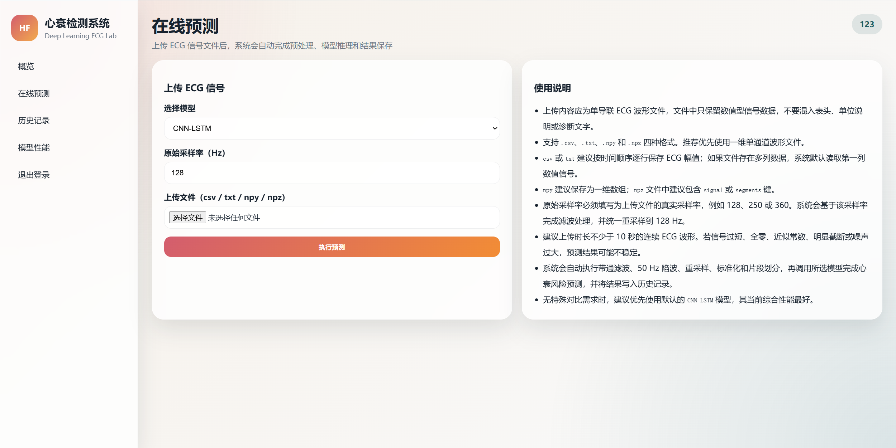
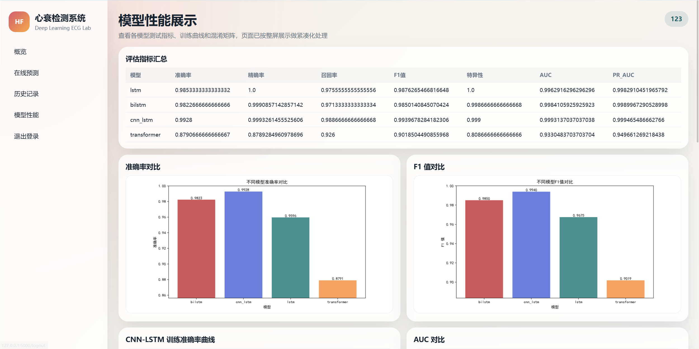
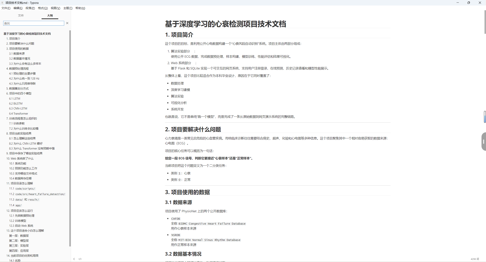

# 基于深度学习的心力衰竭风险识别系统

这是一套基于 ECG 心电信号的心力衰竭辅助识别系统。项目把模型、页面、结果和文档整合在一起，整体风格清晰，展示效果完整。

对不了解算法的同学来说，可以把它理解为：上传一段心电信号，系统自动判断风险高低，并给出结果、图表和历史记录。

## 项目亮点

- 有完整的 Web 页面，可以直接展示
- 有多种深度学习模型对比，结果一目了然
- 有历史记录和性能展示，整体更像成品系统
- 有技术文档和实验结果，便于说明项目背景和效果

## 页面展示

### 首页

首页用于展示项目主题、核心指标和系统定位，第一眼就能看到这是一个完整的心衰检测平台。

### 注册与登录

系统带有账号功能，界面简洁，适合做演示和日常使用。

### 系统概览

系统概览页会展示当前使用情况、默认模型和最近预测结果，适合快速说明项目已经跑通。

### 在线预测

在线预测是项目的核心页面。上传 ECG 文件后，系统会自动处理并给出结果。

高风险结果和低风险结果都能展示，便于客户直观看到输入和输出的对应关系。

### 历史记录

系统会自动保存每次预测记录，方便后续查看和对比。

### 模型性能

模型性能页集中展示多模型对比结果，包括准确率、F1 值、AUC 等指标，方便快速判断模型表现。

## 模型清单

项目中对比了 4 种常见的深度学习模型：

- `LSTM`
- `BiLSTM`
- `CNN-LSTM`
- `Transformer`

其中 `CNN-LSTM` 作为默认模型，当前展示效果最好。

## 技术文档与实验结果

项目还配套了完整的技术文档和实验结果说明，内容包括项目背景、数据来源、模型对比和结果总结，便于客户快速了解项目整体情况。

